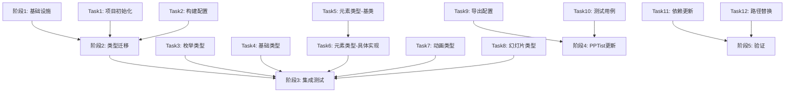
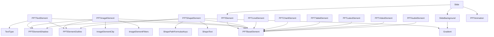

# PPT Editor Element 类型抽离 - 并行任务执行计划

## 一、项目概述

将 PPTist 项目中的所有 Element 类型定义抽离到独立仓库 `ppteditor-types` 进行维护，实现类型定义的独立管理和版本控制。该类型库将作为通用的 PPT 编辑器类型定义，可供多个项目使用。

## 二、当前状态分析

### 2.1 类型定义位置
- **主文件**: `/src/types/slides.ts`
- **包含内容**:
  - 枚举类型：`ShapePathFormulasKeys`、`ElementTypes`
  - 基础类型：渐变、阴影、边框、链接等
  - 9种元素类型：文本、图片、形状、线条、图表、表格、LaTeX、视频、音频
  - 动画相关类型
  - 幻灯片相关类型：Slide、SlideTheme、SlideTemplate等

### 2.2 依赖关系
- **被引用文件数量**: 至少20个文件直接引用
- **引用范围**:
  - 组件层：各种Element组件（TextElement、ImageElement等）
  - 编辑器层：Canvas、Toolbar、样式面板等
  - 业务逻辑层：hooks、store等
  - 移动端：MobileEditor

### 2.3 任务依赖关系图



## 三、抽离方案设计

### 3.1 新仓库结构
```
ppteditor-types/
├── package.json
├── tsconfig.json
├── README.md
├── LICENSE
├── .gitignore
├── .npmignore
├── src/
│   ├── index.ts                 # 主入口，导出所有类型
│   ├── enums/                   # 枚举定义
│   │   ├── index.ts
│   │   ├── shape.ts             # ShapePathFormulasKeys
│   │   └── element.ts           # ElementTypes
│   ├── base/                    # 基础类型
│   │   ├── index.ts
│   │   ├── gradient.ts          # 渐变相关
│   │   ├── shadow.ts            # 阴影
│   │   ├── outline.ts           # 边框
│   │   ├── link.ts              # 链接
│   │   └── common.ts            # 通用类型
│   ├── elements/                # 元素类型
│   │   ├── index.ts
│   │   ├── base.ts              # PPTBaseElement
│   │   ├── text.ts              # PPTTextElement
│   │   ├── image.ts             # PPTImageElement
│   │   ├── shape.ts             # PPTShapeElement
│   │   ├── line.ts              # PPTLineElement
│   │   ├── chart.ts             # PPTChartElement
│   │   ├── table.ts             # PPTTableElement
│   │   ├── latex.ts             # PPTLatexElement
│   │   ├── video.ts             # PPTVideoElement
│   │   └── audio.ts             # PPTAudioElement
│   ├── animation/               # 动画类型
│   │   ├── index.ts
│   │   └── types.ts
│   └── slide/                   # 幻灯片类型
│       ├── index.ts
│       ├── slide.ts
│       ├── background.ts
│       ├── theme.ts
│       └── template.ts
├── dist/                        # 构建输出
│   ├── index.js
│   ├── index.d.ts
│   └── ...
└── tests/                       # 类型测试
    └── types.test.ts
```

### 3.2 包配置

#### package.json
```json
{
  "name": "@ppteditor/types",
  "version": "1.0.0",
  "description": "TypeScript type definitions for PPT Editor elements",
  "main": "dist/index.js",
  "types": "dist/index.d.ts",
  "files": [
    "dist"
  ],
  "scripts": {
    "build": "tsc",
    "build:watch": "tsc --watch",
    "test": "tsc --noEmit",
    "prepublishOnly": "npm run build"
  },
  "keywords": [
    "ppt",
    "editor",
    "typescript",
    "types",
    "presentation"
  ],
  "author": "",
  "license": "MIT",
  "devDependencies": {
    "typescript": "^5.0.0"
  },
  "repository": {
    "type": "git",
    "url": "git+https://github.com/[your-username]/ppteditor-types.git"
  }
}
```

#### tsconfig.json
```json
{
  "compilerOptions": {
    "target": "ES2020",
    "module": "commonjs",
    "lib": ["ES2020"],
    "declaration": true,
    "declarationMap": true,
    "outDir": "./dist",
    "rootDir": "./src",
    "strict": true,
    "esModuleInterop": true,
    "skipLibCheck": true,
    "forceConsistentCasingInFileNames": true,
    "moduleResolution": "node",
    "resolveJsonModule": true,
    "noEmit": false,
    "noUnusedLocals": true,
    "noUnusedParameters": true,
    "noImplicitReturns": true
  },
  "include": ["src/**/*"],
  "exclude": ["node_modules", "dist", "tests"]
}
```

## 四、迁移步骤

### 4.1 第一阶段：创建独立仓库
1. 在 `~/ExploreProject` 创建 `ppteditor-types` 目录
2. 初始化 Git 仓库
3. 创建基础项目结构
4. 配置 TypeScript 和构建环境

### 4.2 第二阶段：迁移类型定义
1. **拆分原始文件**
   - 将 `slides.ts` 按照类型分类拆分到对应目录
   - 保持所有类型定义不变，确保兼容性

2. **组织导出结构**
   - 每个子模块有自己的 index.ts
   - 主 index.ts 统一导出所有类型
   - 支持按需导入和全量导入

### 4.3 第三阶段：构建和测试
1. **构建配置**
   - 生成 CommonJS 和 ES Module 两种格式
   - 生成完整的类型声明文件
   - 支持 source maps

2. **类型测试**
   - 创建类型测试文件
   - 验证所有类型定义正确性
   - 确保没有循环依赖

### 4.4 第四阶段：发布配置
1. **NPM发布**（如果需要）
   - 配置 .npmignore
   - 设置版本号
   - 发布到 npm registry

2. **本地链接**（开发阶段）
   - 使用 npm link 进行本地开发
   - 或使用 file: 协议引用

### 4.5 第五阶段：更新 PPTist 项目
1. **安装新包**
   ```bash
   npm install @ppteditor/types
   # 或本地开发
   npm link @ppteditor/types
   ```

2. **更新导入路径**
   - 批量替换所有 `@/types/slides` 为 `@ppteditor/types`
   - 更新具体的导入语句

3. **验证功能**
   - 运行项目确保没有类型错误
   - 测试各个功能模块

## 五、类型依赖关系图



## 六、注意事项

### 6.1 兼容性保证
- 保持所有类型名称不变
- 保持类型结构完全一致
- 提供向后兼容的导出方式

### 6.2 版本管理
- 使用语义化版本号
- 主版本号变更表示不兼容更新
- 次版本号表示新增功能
- 补丁版本表示问题修复

### 6.3 文档维护
- 为每个类型添加 JSDoc 注释
- 创建完整的 API 文档
- 提供迁移指南

### 6.4 持续集成
- 设置 GitHub Actions 自动构建
- 添加类型检查的 CI 流程
- 自动发布到 npm（可选）

## 七、迁移收益

1. **独立维护**: 类型定义独立版本控制
2. **复用性**: 其他项目可以直接使用这些类型
3. **清晰架构**: 类型定义结构更加清晰
4. **更好的文档**: 独立的类型文档和示例
5. **类型安全**: 更严格的类型检查和测试

## 八、风险评估

1. **迁移风险**:
   - 需要更新大量引用路径
   - 可能存在遗漏的引用

2. **缓解措施**:
   - 使用自动化脚本批量替换
   - 充分测试各个功能模块
   - 保留原文件作为备份

## 九、时间估算

- 创建仓库结构：1小时
- 迁移类型定义：2小时
- 配置构建流程：1小时
- 更新 PPTist 引用：2小时
- 测试验证：2小时
- **总计：约8小时**

## 十、并行任务集合详细规划

### 阶段1：基础设施构建（2个并行Agent）

#### Agent 1: 项目初始化专员
**任务范围**: 创建项目基础结构
```yaml
任务清单:
  - 创建目录: ~/ExploreProject/ppteditor-types
  - 初始化 git 仓库
  - 创建基础目录结构:
    - src/
    - src/enums/
    - src/base/
    - src/elements/
    - src/animation/
    - src/slide/
    - tests/
    - dist/
  - 创建基础文件:
    - README.md
    - LICENSE (MIT)
    - .gitignore
    - .npmignore
  - 初始化 package.json
输出: 完整的项目目录结构
```

#### Agent 2: 构建配置专员
**任务范围**: 配置构建环境
```yaml
任务清单:
  - 创建 tsconfig.json
  - 配置构建脚本
  - 设置 ESLint 配置（可选）
  - 创建 GitHub Actions 工作流（可选）
  - 配置 npm 发布脚本
输出: 完整的构建配置
依赖: 无（可与Agent 1并行）
```

### 阶段2：类型迁移（6个并行Agent组）

#### Agent Group A: 独立类型组（3个并行Agent）

##### Agent 3: 枚举类型迁移专员
**任务范围**: src/enums/
```yaml
负责文件:
  - src/enums/index.ts
  - src/enums/shape.ts (ShapePathFormulasKeys)
  - src/enums/element.ts (ElementTypes)

任务内容:
  - 从 slides.ts 提取枚举定义
  - 创建独立的枚举文件
  - 设置导出结构

依赖: 阶段1完成
冲突风险: 无
```

##### Agent 4: 基础类型迁移专员
**任务范围**: src/base/
```yaml
负责文件:
  - src/base/index.ts
  - src/base/gradient.ts (Gradient, GradientType, GradientColor)
  - src/base/shadow.ts (PPTElementShadow)
  - src/base/outline.ts (PPTElementOutline, LineStyleType)
  - src/base/link.ts (PPTElementLink, ElementLinkType)
  - src/base/common.ts (TextAlign, TextType, Fit等)

任务内容:
  - 提取所有基础类型定义
  - 按功能分类到不同文件
  - 确保类型之间的引用关系正确

依赖: 阶段1完成
冲突风险: 无
```

##### Agent 5: 动画类型迁移专员
**任务范围**: src/animation/
```yaml
负责文件:
  - src/animation/index.ts
  - src/animation/types.ts

涉及类型:
  - PPTAnimation
  - AnimationType
  - AnimationTrigger

任务内容:
  - 提取动画相关类型
  - 创建动画模块结构

依赖: 阶段1完成
冲突风险: 无
```

#### Agent Group B: 元素类型组（需要顺序执行）

##### Agent 6: 元素基类迁移专员
**任务范围**: src/elements/base.ts
```yaml
负责内容:
  - PPTBaseElement 接口定义
  - PPTElement 联合类型定义

任务内容:
  - 创建元素基类定义
  - 确保所有必要的导入

依赖: Agent 4 (基础类型)
冲突风险: 低
```

##### Agent 7-9: 元素具体类型迁移专员（3个并行）

###### Agent 7: 文本图片元素专员
**任务范围**: 文本和图片元素
```yaml
负责文件:
  - src/elements/text.ts (PPTTextElement, ShapeText, ShapeTextAlign)
  - src/elements/image.ts (PPTImageElement, ImageOrShapeFlip, ImageElementFilters等)

依赖: Agent 6完成
冲突风险: 无（独立文件）
```

###### Agent 8: 形状线条元素专员
**任务范围**: 形状和线条元素
```yaml
负责文件:
  - src/elements/shape.ts (PPTShapeElement)
  - src/elements/line.ts (PPTLineElement, LinePoint)

依赖: Agent 6完成
冲突风险: 无（独立文件）
```

###### Agent 9: 复杂元素专员
**任务范围**: 图表、表格和媒体元素
```yaml
负责文件:
  - src/elements/chart.ts (PPTChartElement, ChartType, ChartData等)
  - src/elements/table.ts (PPTTableElement, TableCell, TableTheme等)
  - src/elements/latex.ts (PPTLatexElement)
  - src/elements/video.ts (PPTVideoElement)
  - src/elements/audio.ts (PPTAudioElement)

依赖: Agent 6完成
冲突风险: 无（独立文件）
```

#### Agent Group C: 幻灯片类型组

##### Agent 10: 幻灯片类型迁移专员
**任务范围**: src/slide/
```yaml
负责文件:
  - src/slide/index.ts
  - src/slide/slide.ts (Slide, Note, NoteReply, SectionTag)
  - src/slide/background.ts (SlideBackground相关)
  - src/slide/theme.ts (SlideTheme)
  - src/slide/template.ts (SlideTemplate)
  - src/slide/types.ts (TurningMode, SlideType等)

依赖: Agent 3-5 (需要引用基础类型和动画类型)
冲突风险: 低
```

### 阶段3：集成配置（2个并行Agent）

#### Agent 11: 导出配置专员
**任务范围**: 主导出文件和模块索引
```yaml
负责文件:
  - src/index.ts (主导出)
  - 各模块的 index.ts 文件更新

任务内容:
  - 配置完整导出策略
  - 支持按需导入
  - 支持命名空间导出
  - 创建类型别名便于迁移

依赖: 阶段2所有Agent完成
```

#### Agent 12: 测试配置专员
**任务范围**: 测试和验证
```yaml
负责文件:
  - tests/types.test.ts
  - tests/compatibility.test.ts
  - 示例使用文件

任务内容:
  - 创建类型测试
  - 验证导出完整性
  - 创建使用示例

依赖: Agent 11
```

### 阶段4：PPTist项目更新（2个并行Agent）

#### Agent 13: 依赖更新专员
**任务范围**: 更新PPTist项目配置
```yaml
任务清单:
  - 更新 package.json 添加 @ppteditor/types 依赖
  - 配置本地链接 (npm link)
  - 更新 tsconfig.json paths 配置
  - 验证依赖安装成功

影响文件:
  - package.json
  - tsconfig.json
  - package-lock.json
```

#### Agent 14: 路径替换专员
**任务范围**: 批量更新导入路径
```yaml
任务清单:
  - 批量替换 '@/types/slides' -> '@ppteditor/types'
  - 批量替换 '../types/slides' -> '@ppteditor/types'
  - 更新具体的导入语句
  - 处理特殊情况和边界案例

影响文件: 约20+个文件
工具建议: 使用正则表达式批量替换
```

### 阶段5：验证测试（1个Agent）

#### Agent 15: 集成验证专员
**任务范围**: 端到端验证
```yaml
任务清单:
  - 运行 ppteditor-types 构建
  - 验证类型导出完整性
  - 运行 PPTist 项目构建
  - 执行类型检查 (tsc --noEmit)
  - 运行项目测试套件
  - 验证运行时功能正常

成功标准:
  - 无类型错误
  - 构建成功
  - 测试通过
  - 运行时无异常
```

## 十一、Agent执行矩阵

| 阶段 | Agent组 | 并行数 | 预计耗时 | 依赖关系 |
|------|---------|--------|----------|----------|
| 1 | 基础设施 | 2 | 30分钟 | 无 |
| 2A | 独立类型 | 3 | 45分钟 | 阶段1 |
| 2B | 元素基类 | 1 | 15分钟 | 阶段1+Agent4 |
| 2C | 具体元素 | 3 | 45分钟 | Agent6 |
| 2D | 幻灯片 | 1 | 30分钟 | 阶段2A |
| 3 | 集成配置 | 2 | 30分钟 | 阶段2 |
| 4 | 项目更新 | 2 | 45分钟 | 阶段3 |
| 5 | 验证 | 1 | 30分钟 | 阶段4 |

**总计最短时间**: 约4小时（考虑并行执行）

## 十二、冲突避免策略

### 12.1 文件级别隔离
- 每个Agent负责独立的文件/目录
- 避免多个Agent同时修改同一文件
- 使用明确的文件边界划分任务

### 12.2 依赖管理
- 明确定义Agent间的依赖关系
- 使用阶段性checkpoint确认
- 基础类型优先完成，避免阻塞

### 12.3 命名空间隔离
```typescript
// 每个模块独立的命名空间，避免命名冲突
export * as Enums from './enums';
export * as Base from './base';
export * as Elements from './elements';
```

### 12.4 Git分支策略
```bash
main
├── feature/infrastructure    # Agent 1-2
├── feature/enums             # Agent 3
├── feature/base-types        # Agent 4
├── feature/animation         # Agent 5
├── feature/elements          # Agent 6-9
├── feature/slide            # Agent 10
└── feature/integration      # Agent 11-12
```

## 十三、Agent具体指令模板

### Agent 1 示例指令
```markdown
创建 ppteditor-types 项目基础结构：
1. 在 ~/ExploreProject/ 创建 ppteditor-types 目录
2. 初始化 git 仓库
3. 创建完整的目录结构（src/, tests/, dist/）
4. 创建所有子目录（enums/, base/, elements/, animation/, slide/）
5. 创建基础配置文件（.gitignore, .npmignore）
6. 生成 README.md 和 LICENSE 文件
注意：不要创建任何 .ts 文件，只创建目录和配置文件
```

### Agent 3 示例指令
```markdown
迁移枚举类型到 src/enums/：
1. 从 PPTist/src/types/slides.ts 提取 ShapePathFormulasKeys 枚举
2. 创建 src/enums/shape.ts 文件
3. 从 PPTist/src/types/slides.ts 提取 ElementTypes 枚举
4. 创建 src/enums/element.ts 文件
5. 创建 src/enums/index.ts 导出所有枚举
注意：保持原有的枚举值不变，确保兼容性
```

## 十四、验证检查清单

### 14.1 类型完整性检查
- [ ] 所有原始类型都已迁移
- [ ] 类型名称保持一致
- [ ] 导出路径正确
- [ ] 无循环依赖

### 14.2 构建验证
- [ ] ppteditor-types 构建成功
- [ ] 生成 .d.ts 文件
- [ ] 无 TypeScript 错误

### 14.3 集成验证
- [ ] PPTist 项目依赖更新
- [ ] 导入路径全部替换
- [ ] 项目构建成功
- [ ] 运行时正常

### 14.4 功能验证
- [ ] 创建元素功能正常
- [ ] 编辑器功能正常
- [ ] 导入导出功能正常
- [ ] 动画功能正常

## 十五、风险缓解措施

### 15.1 回滚计划
1. 保留原 slides.ts 文件备份
2. 使用 git 分支进行隔离
3. 准备快速回滚脚本

### 15.2 渐进式迁移
1. 先在开发环境验证
2. 保留兼容性导出
3. 分阶段更新引用

### 15.3 监控点
- 构建时间对比
- bundle size 变化
- 类型检查性能
- 运行时性能

## 十六、具体实施细节

### 16.1 类型拆分详情

#### 枚举类型 (enums/)
- `ShapePathFormulasKeys`: 形状路径公式键值
- `ElementTypes`: 元素类型枚举

#### 基础类型 (base/)
- `Gradient`: 渐变相关（GradientType, GradientColor, Gradient）
- `Shadow`: 阴影（PPTElementShadow）
- `Outline`: 边框（PPTElementOutline, LineStyleType）
- `Link`: 链接（PPTElementLink, ElementLinkType）
- `Common`: 通用类型定义

#### 元素类型 (elements/)
每个元素类型独立文件，包含：
- 元素特有的类型定义
- 元素接口定义
- 相关辅助类型

#### 动画类型 (animation/)
- `PPTAnimation`: 动画定义
- `AnimationType`: 动画类型
- `AnimationTrigger`: 触发方式

#### 幻灯片类型 (slide/)
- `Slide`: 幻灯片主体
- `SlideBackground`: 背景相关
- `SlideTheme`: 主题定义
- `SlideTemplate`: 模板定义
- 辅助类型：Note, NoteReply, SectionTag, TurningMode等

### 16.2 导出策略

```typescript
// src/index.ts 示例
// 完整导出
export * from './enums';
export * from './base';
export * from './elements';
export * from './animation';
export * from './slide';

// 命名空间导出（可选）
export * as Enums from './enums';
export * as Base from './base';
export * as Elements from './elements';
export * as Animation from './animation';
export * as Slide from './slide';
```

### 16.3 使用示例

```typescript
// 在 PPTist 项目中使用
// 方式1：直接导入
import { PPTElement, Slide, ElementTypes } from '@ppteditor/types';

// 方式2：命名空间导入
import { Elements, Slide } from '@ppteditor/types';
const element: Elements.PPTTextElement = { ... };

// 方式3：按需导入特定模块
import { PPTTextElement } from '@ppteditor/types/elements';
import { SlideTheme } from '@ppteditor/types/slide';
```

### 16.4 版本迁移路径

1. **v1.0.0**: 初始版本，完全复制现有类型
2. **v1.1.0**: 添加更详细的 JSDoc 文档
3. **v1.2.0**: 优化类型结构，添加工具类型
4. **v2.0.0**: 可能的破坏性更改（如需要）

## 十七、后续优化建议

### 17.1 短期优化（v1.1）
- 添加详细的 JSDoc 注释
- 创建在线文档
- 添加更多类型工具函数

### 17.2 中期优化（v1.2）
- 优化类型结构
- 添加类型守卫函数
- 提供类型转换工具

### 17.3 长期规划（v2.0）
- 考虑支持插件系统
- 添加自定义元素类型
- 国际化支持